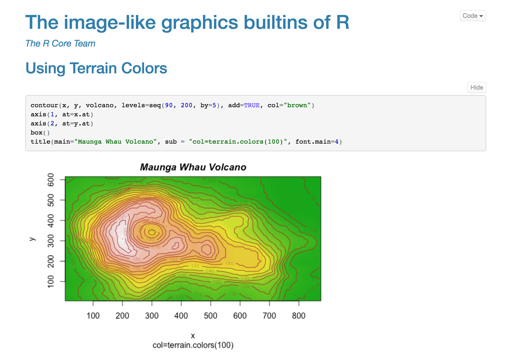

```{r setup, include=FALSE}
knitr::opts_chunk$set(echo = FALSE)
```

## What We'd Like to See...

| | &nbsp;&nbsp;&nbsp;&nbsp;&nbsp;&nbsp;R Markdown&nbsp;&nbsp;&nbsp;&nbsp;&nbsp;&nbsp; | &nbsp;&nbsp;&nbsp;&nbsp;&nbsp;Notebooks&nbsp;&nbsp;&nbsp;&nbsp;&nbsp;
|-------------------------------|:-------------------:|:-------------------:|
| Plain text representation | &#x2714;  |  |
| Same editor/tools used for R scripts  | &#x2714;  |  |
| Works well with version control  | &#x2714; |  |
| Focus on production output  | &#x2714;  |  |
| Output inline with code  | &#x2714; | &#x2714; |
| Output cached across sessions | &#x2714; | &#x2714; |
| Share code and output in a single file | &#x2714; | &#x2714; |
| Emphasized execution model | Interactive & Batch | Interactive |

## Notebook Sharing | *Notebooks can be published as an HTML file with Rmd source embedded*



## Notebook Source and Output

- Notebook source code is an R Markdown (`.Rmd`) file

- Notebooks have an associated HTML file (`.nb.html`):
    - Includes `.Rmd` source code and output
    - Created automatically by RStudio IDE when `html_notebook` Rmd is saved
    - Can also be created from the command line via `rmarkdown::html_notebook` format

- RStudio IDE will provide a special diff view of notebook HTML files that enables users to clearly see changes in both source code and output

- Notebooks can also be rendered into *any other* R Markdown format


